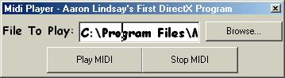



## DirectX 7 MIDI Player

### Description

I built this as my first DirectX program. I know I should have done it in DX 8 but I did it in DX7 because it's easier to find DX7 tutorials.
 
### More Info
 
You must have DirectX7 or higher installed on your computer.

             |
---                |---
**Submitted On**   |2002-06-09 11:49:10
**By**             |[AML](https://github.com/Planet-Source-Code/PSCIndex/blob/master/ByAuthor/aml.md)
**Level**          |Beginner
**User Rating**    |4.5 (18 globes from 4 users)
**Compatibility**  |VB 5\.0, VB 6\.0
**Category**       |[DirectX](https://github.com/Planet-Source-Code/PSCIndex/blob/master/ByCategory/directx__1-44.md)
**World**          |[Visual Basic](https://github.com/Planet-Source-Code/PSCIndex/blob/master/ByWorld/visual-basic.md)
**Archive File**   |[DirectX\_7\_92120692002\.zip](https://github.com/Planet-Source-Code/aml-directx-7-midi-player__1-35651/archive/master.zip)

